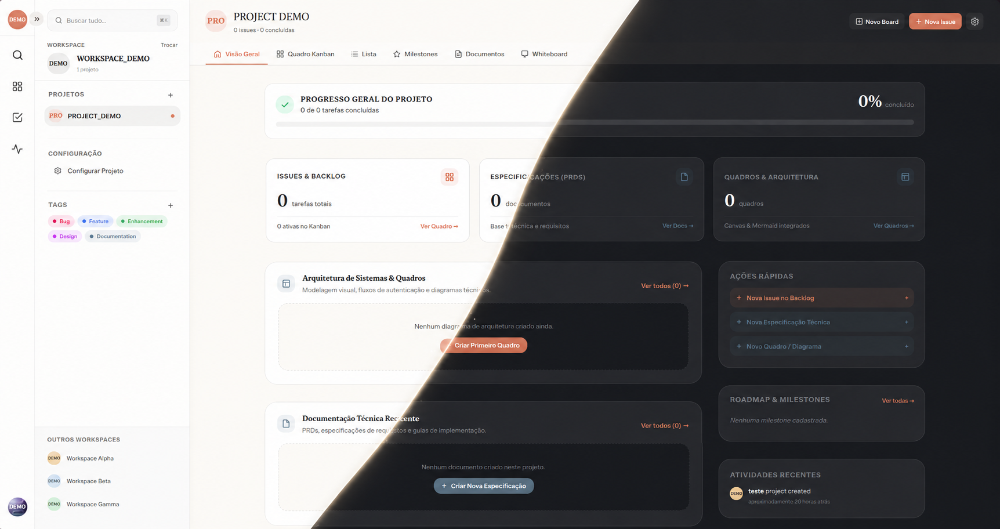
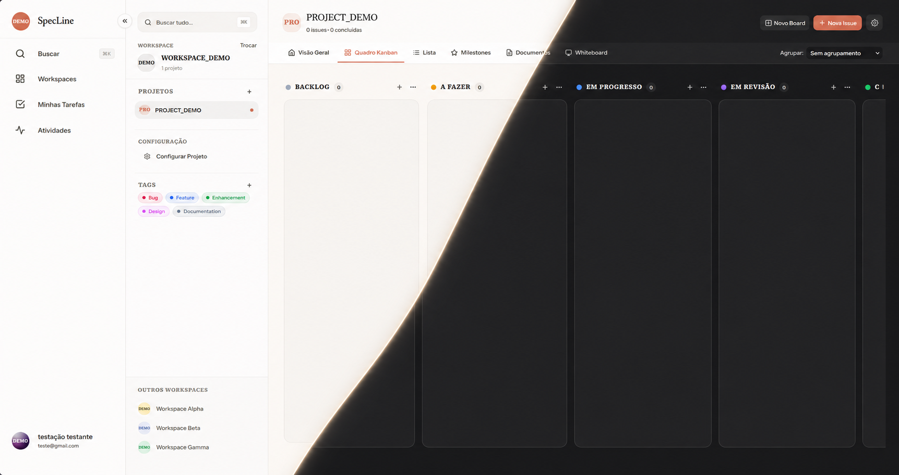
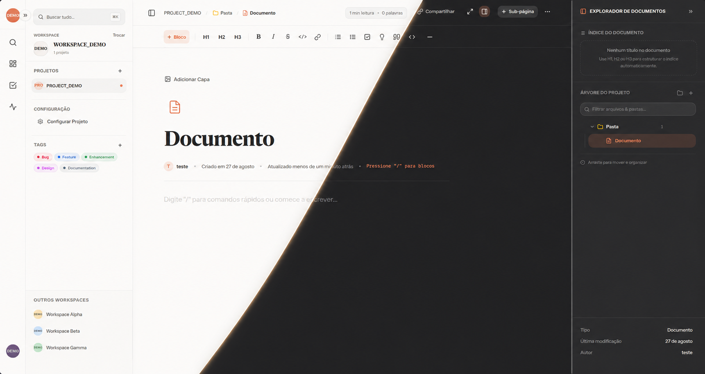
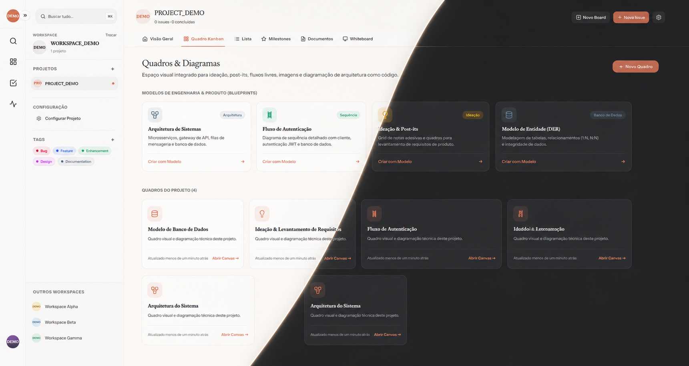
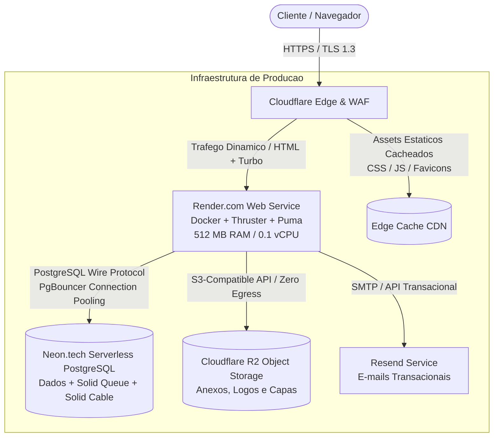

<div align="center">

  

  # SpecLine

  **Plataforma Unificada de Engenharia de Produto e Documentação Técnica**

  _Consolidação contextual de especificações de software, rastreabilidade de tarefas em quadros Kanban e modelagem visual de arquitetura em um ecossistema integrado._

  <br />

  [](https://rubyonrails.org/)
  [](https://www.ruby-lang.org/)
  [](https://hotwired.dev/)
  [](https://tailwindcss.com/)
  [](https://www.postgresql.org/)
  [](https://www.docker.com/)
  [](#7-verificação-de-qualidade-e-segurança)
  [](LICENSE)

  <br />

  [Visão Geral](#1-visão-geral-e-proposta-de-engenharia) •
  [Galeria da Plataforma](#2-galeria-da-plataforma) •
  [Arquitetura do Sistema](#3-arquitetura-do-sistema-e-topologia) •
  [Matriz Tecnológica](#4-matriz-tecnológica) •
  [Instalação e Execução](#6-ambiente-de-desenvolvimento-local) •
  [Diretrizes de Contribuição](#9-como-contribuir)

</div>

---

## 1. Visão Geral e Proposta de Engenharia

No ciclo de vida do desenvolvimento de software, equipes técnicas enfrentam perdas contínuas de contexto operacional decorrentes da dispersão de informações. Especificações funcionais (PRDs) residem em plataformas de texto isoladas, itens de backlog ficam dissociados em rastreadores de tarefas, diagramas de sistema permanecem em ferramentas gráficas externas e deliberações técnicas se perdem em canais de comunicação efêmeros.

O **SpecLine** foi concebido para unificar esses fluxos sob uma arquitetura de dados coesa:

* **Documentação Estruturada:** Criação e manutenção de especificações técnicas vinculadas diretamente aos módulos do sistema.
* **Rastreabilidade Bidirecional:** Associação direta entre itens do quadro Kanban e suas respectivas seções no documento funcional.
* **Modelagem Visual Integrada:** Elaboração de arquiteturas de software e fluxogramas em canvas vetorial interativo.
* **Arquitetura de Alta Eficiência:** Desenvolvido sobre o **Ruby on Rails 8 Solid Stack**, eliminando a necessidade de serviços intermediários pagos (como instâncias dedicadas de Redis) ao empregar `Solid Queue`, `Solid Cable` e `Solid Cache` persistidos no PostgreSQL.

---

## 2. Galeria da Plataforma

<div align="center">

### Painel Geral e Gestão de Workspaces
_Métricas de velocidade, progresso consolidado de entregas e alternância rápida entre projetos e workspaces._



<br /><br />

### Quadro Kanban Contextual (Linear-Tier)
_Gestão fluida de tarefas com agrupamento por Milestones, tags semânticas, estimativas e drag-and-drop instantâneo via Turbo Streams._



<br /><br />

### Editor de Especificações (TipTap & Modo Foco)
_Editor técnico de alta performance com suporte a comandos rápidos (/), tabela de conteúdos dinâmica (TOC), capas gradientes, blocos de código e modo foco imersivo._



<br /><br />

### Canvas de Arquitetura e Diagramação Vetorial
_Área visual colaborativa com renderização vetorial artística via Rough.js, suporte a diagramas Mermaid.js e notas adesivas técnicas._



</div>

---

## 3. Arquitetura do Sistema e Topologia



---

## 4. Matriz Tecnológica

| Camada | Tecnologia | Justificativa Arquitetural |
| :--- | :--- | :--- |
| **Backend & Core** | **Ruby on Rails 8.1** | Monólito modular com padrão MVC, Active Storage e geradores de código. |
| **Reatividade Frontend** | **Hotwire (Turbo 8 + Stimulus)** | Reatividade em tempo real e navegação acelerada sem complexidade de SPA. |
| **Design System** | **Tailwind CSS v4** | Paleta semântica personalizada (Ink, Fable, Terracotta, Olive, Sage, Slate, Ochre, Rust). |
| **Filas & WebSockets** | **Solid Queue & Solid Cable** | Processamento assíncrono e mensageria distribuída persistidos no PostgreSQL. |
| **Editor Rich Text** | **TipTap Core + Extensions** | Editor estruturado em blocos com checklists, atalhos, tabelas e exportação Markdown. |
| **Canvas Vetorial** | **Rough.js + Mermaid.js** | Diagramação de software e arquitetura com renderização leve no cliente. |
| **Banco de Dados** | **PostgreSQL 16 (Neon.tech)** | Instância serverless de alta escala com pooling de conexões via PgBouncer. |
| **Servidor & Proxy** | **Puma + Thruster** | Proxy HTTP/2 de alta performance com compressão gzip/brotli e cache de ativos. |
| **Containerização** | **Docker Multi-Stage** | Imagem enxuta protegida com jemalloc e execução por usuário não-root. |
| **Armazenamento** | **Cloudflare R2** | Armazenamento de arquivos compatível com S3 com isenção total de taxas de transferência. |

---

## 5. Índice de Documentação Técnica

Especificações aprofundadas de engenharia estão centralizadas no diretório `docs/`:

* **[Constituição de Desenvolvimento (docs/architecture/SPECLINE_CONSTITUTION.md)](docs/architecture/SPECLINE_CONSTITUTION.md):** Princípios de arquitetura, qualidade e metodologia TDD.
* **[Infraestrutura & Capacidade (docs/architecture/INFRASTRUCTURE_AND_CAPACITY.md)](docs/architecture/INFRASTRUCTURE_AND_CAPACITY.md):** Dimensionamento de volumetria, análise de TCO e estratégia zero-cost.
* **[Blueprint de Segurança (docs/architecture/SECURITY_BLUEPRINT.md)](docs/architecture/SECURITY_BLUEPRINT.md):** Defesas contra IDOR, sanitização HTML, rate limiting via Rack::Attack e validação binária de arquivos.
* **[Roadmap de Sprints (docs/SPRINTS.md)](docs/SPRINTS.md):** Histórico de entregas e módulos planejados.
* **[Planejamento Acadêmico & Gestão PEI VI (docs/academic/Planejamento_Gestao_SpecLine_PEI_VI.md)](docs/academic/Planejamento_Gestao_SpecLine_PEI_VI.md):** Planejamento acadêmico e EAP do projeto extensionista.

---

## 6. Ambiente de Desenvolvimento Local

### 6.1. Pré-requisitos
* **Ruby:** `3.4.1` (gerenciado via `asdf`, `rbenv` ou `mise`)
* **Node.js:** `20.x` ou superior com `npm`
* **SQLite3** (para desenvolvimento local) ou **PostgreSQL 16**
* **Libvips** (dependência nativa para processamento de imagens)

### 6.2. Procedimento de Instalação

1. **Clonar o repositório:**
   ```bash
   git clone https://github.com/PacEvill/SpecLine.git
   cd SpecLine
   ```

2. **Configurar as variáveis de ambiente:**
   ```bash
   cp .env.example .env
   ```

3. **Instalar as dependências do projeto:**
   ```bash
   bundle install
   npm install
   ```

4. **Inicializar a base de dados e migrações:**
   ```bash
   bin/rails db:setup
   ```

5. **Iniciar o servidor de desenvolvimento unificado:**
   ```bash
   bin/dev
   ```

6. **Acessar a aplicação:**
   Abra no navegador o endereço `http://localhost:3000`.

---

## 7. Verificação de Qualidade e Segurança

O SpecLine adota rotinas de testes automatizados e análise estática contínua de vulnerabilidades:

```bash
# Execução dos testes unitários e de integração (TDD)
bin/rails test

# Execução dos testes de sistema end-to-end
bin/rails test:system

# Análise estática de código e padronização de estilo Ruby
bin/rubocop

# Auditoria de segurança estática para vulnerabilidades Rails (Brakeman)
bin/brakeman --no-pager

# Auditoria de vulnerabilidades em dependências Ruby (CVEs)
bin/bundler-audit check --update

# Auditoria de pacotes JavaScript
npm audit
```

---

## 8. Build e Execução via Docker

Para compilar e executar o contêiner de produção com Thruster localmente:

```bash
# Compilação da imagem Docker Multi-Stage
docker build -t specline .

# Execução do contêiner compilado
docker run -d -p 8080:80 \
  -e RAILS_MASTER_KEY=<sua_chave_master> \
  -e DATABASE_URL=<url_postgres> \
  --name specline specline
```

---

## 9. Como Contribuir

Contribuições para o aprimoramento da plataforma são bem-vindas. Para colaborar:

1. Realize um **Fork** do repositório.
2. Crie uma branch para sua funcionalidade: `git checkout -b feature/nome-da-funcionalidade`.
3. Escreva testes automatizados cobrindo a nova lógica (`bin/rails test`).
4. Assegure a conformidade de linters e segurança: `bin/rubocop` e `bin/brakeman`.
5. Registre o commit das alterações: `git commit -m 'feat: implementa nova funcionalidade'`.
6. Envie para o branch remoto: `git push origin feature/nome-da-funcionalidade`.
7. Abra um **Pull Request** detalhando as mudanças realizadas.

---

## 10. Contexto Institucional e Licença

Projeto desenvolvido por **Diego Silva Pereira Pacheco** (Matrícula: 202413831) no âmbito da disciplina **Práticas Extensionistas Integradoras VI** (6º Período - Engenharia de Software) da **Universidade de Vassouras — Campus Maricá (FUSVE)**, sob docência e orientação da **Profª. Laís Cristine Bordallo Pinheiro** e apoio técnico do **Prof. Me. Victor Andrade da Silveira**.

Distribuído sob a licença **MIT**. Consulte o arquivo [LICENSE](LICENSE) para termos complementares.
