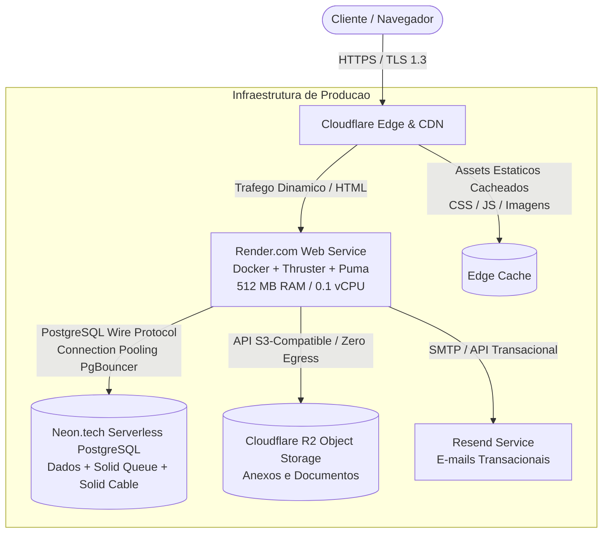

# SpecLine

Plataforma unificada de engenharia de produto projetada para consolidar documentacao tecnica, gestao visual de demandas em quadros contextuais e comunicacao integrada em um unico ecossistema, mitigando a dispersao de informacoes e a perda de contexto operacional.

[](https://rubyonrails.org/)
[](https://www.ruby-lang.org/)
[](https://hotwired.dev/)
[](https://tailwindcss.com/)
[](https://www.postgresql.org/)
[](https://www.docker.com/)
[](LICENSE)

---

## 1. Visao Geral e Proposta de Engenharia

O SpecLine aborda o problema critico da fragmentacao no desenvolvimento de software, no qual equipes técnicas mantem especificacoes, itens de backlog e discussoes em plataformas desconectadas.

### Principais Diretrizes do Projeto

- **Centralizacao Contextual:** Integracao nativa entre documentos de produto (PRDs) e tarefas no fluxo Kanban.
  - **Autenticação Descomplicada:** Suporte completo nativo a Google OAuth 2.0.
  - **Monolito Modular de Alta Eficiência:** Arquitetura coesa em Ruby on Rails 8 que elimina serviços intermediários dedicados (como instâncias pagas de Redis), viabilizando operação de alto desempenho com custo zero de infraestrutura.

---

## 2. Galeria da Plataforma (Screenshots)

_Para adicionar os prints finais, basta salvar as imagens na pasta `docs/images/` e descomentar as linhas abaixo._

### Painel Geral de Projetos


_Visão central do Workspace, contendo as métricas principais e a lista de projetos ativos._

### Quadro Kanban Interativo (Issues)


_Gestão drag-and-drop de tarefas com edição diretamente em pop-ups rápidos (Turbo Frames)._

### Documentações (Editor Contextual)


_Editor no estilo Notion para especificações de produto e documentação técnica._

### Gestão de Metas (Milestones)


_Acompanhamento e organização de agrupamentos de entregas visando previsibilidade._

---

## 3. Arquitetura do Sistema e Topologia



---

## 3. Modulos e Subsistemas

| Subsistema                        | Escopo e Capacidades Tecnicas                                                              |
| :-------------------------------- | :----------------------------------------------------------------------------------------- |
| **Quadro Kanban Contextual**      | Gestao de fluxo com atualizacao em tempo real via Turbo Streams e persistencia assincrona. |
| **Documentacao e Especificacoes** | Editor estruturado com suporte a Markdown, formatacao tecnica e anexos de midia.           |
| **Comunicacao Contextual**        | Registro de mensagens e discussoes diretamente atrelado a cards e documentos.              |
| **Canvas e Prototipacao**         | Area colaborativa para diagramacao de fluxos e especificacao visual.                       |
| **Relatorios e Metricas**         | Consolidacao de indicadores de desempenho e exportacao em PDF.                             |
| **Autenticacao e Seguranca**      | Gestao de sessoes, criptografia bcrypt via Devise e integracao Google OAuth2.              |

---

## 4. Matriz Tecnologica

| Camada                       | Tecnologia                 | Justificativa Arquitetural                                               |
| :--------------------------- | :------------------------- | :----------------------------------------------------------------------- |
| **Backend & Core**           | Ruby on Rails 8.1          | Framework full-stack coeso com arquitetura MVC e geradores de codigo.    |
| **Reatividade**              | Hotwire (Turbo + Stimulus) | Reatividade em tempo real e navegacao acelerada sem complexidade de SPA. |
| **Estilizacao**              | Tailwind CSS 3.4           | Framework utilitario com pipeline PostCSS e design system semantico.     |
| **Filas e WebSockets**       | Solid Queue & Solid Cable  | Background jobs e mensageria em tempo real persistidos no PostgreSQL.    |
| **Banco Local**              | SQLite3                    | Banco relacional leve e sem dependencia externa para desenvolvimento.    |
| **Banco Producao**           | Neon.tech PostgreSQL       | Instancia serverless com auto-scaling e connection pooling integrado.    |
| **Servidor de Aplicacao**    | Puma + Thruster            | Servidor concorrente protegido por proxy HTTP/2 com cache de memoria.    |
| **Containerizacao**          | Docker Multi-Stage         | Imagem compacta e segura com otimizacao de memoria via `jemalloc`.       |
| **Armazenamento de Objetos** | Cloudflare R2              | Storage compativel com S3 com isencao total de taxas de transferencia.   |
| **E-mails Transacionais**    | Resend                     | Servico de envio de e-mails transacionais de alta entregabilidade.       |

---

## 5. Indice de Documentacao Tecnica

Especificacoes detalhadas de engenharia estao disponiveis no diretorio `docs/`:

- [Especificacao da Stack Tecnica](docs/STACK.md): Detalhamento dos componentes, gems, pacotes e versoes.
- [Documento de Arquitetura e Engenharia de Capacidade](docs/INFRASTRUCTURE_AND_CAPACITY.md): Dimensionamento de volumetria, capacidade de usuarios simultaneos, analise de TCO e justificativa da estrategia zero-cost.

---

## 6. Ambiente de Desenvolvimento Local

### 6.1. Pre-requisitos do Sistema

- **Ruby:** `3.4.x` (gerenciado via `asdf`, `rbenv` ou `mise`)
- **Node.js:** `20.x` ou superior com gerenciador `npm`
- **SQLite3:** `3.x`
- **Libvips:** Dependencia nativa para processamento de imagens

### 6.2. Procedimento de Instalacao

1. Clone o repositorio:

   ```bash
   git clone https://github.com/diego-silva/SpecLine.git
   cd SpecLine
   ```

2. Configure as variaveis de ambiente:

   ```bash
   cp .env.example .env
   ```

3. Instale as dependencias do projeto:

   ```bash
   bundle install
   npm install
   ```

4. Inicialize a base de dados local:

   ```bash
   bin/rails db:setup
   ```

5. Inicie o servidor de desenvolvimento unificado:

   ```bash
   bin/dev
   ```

6. Acesse a aplicacao no endereco: `http://localhost:3000`

---

## 7. Verificacao de Qualidade e Seguranca

A suite de testes e analise estatica pode ser executada por meio dos seguintes comandos:

```bash
# Execucao dos testes unitarios e de integracao
bin/rails test

# Execucao dos testes de sistema end-to-end

bin/rails test:system

# Analise estatica de codigo Ruby
bin/rubocop

# Auditoria de seguranca estatica para vulnerabilidades Rails
bin/brakeman

# Auditoria de vulnerabilidades em dependencias (CVEs)
bin/bundler-audit
```

---

## 8. Build e Execucao via Container Docker

Para compilar e executar o container de producao com Thruster localmente:

```bash
# Compilacao da imagem Docker
docker build -t specline .

# Execucao da imagem compilada
docker run -d -p 8080:80 -e RAILS_MASTER_KEY=<chave_master> --name specline specline
```

---

## 9. Contexto Institucional e Licenca

Projeto desenvolvido por **Diego Silva** no contexto da disciplina **Praticas Extensionistas Integradoras VI**.

Distribuido sob a licenca **MIT**. Consulte o arquivo `LICENSE` para informacoes complementares.
