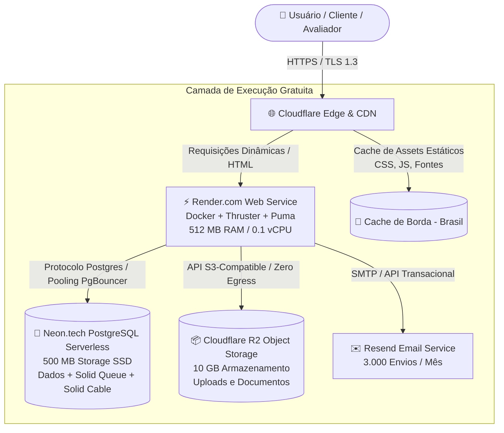

dei 

# Documento de Arquitetura e Engenharia de Infraestrutura — SpecLine

**Projeto:** SpecLine — Workspace Unificado para Engenharia de Produto
**Contexto:** Práticas Extensionistas Integradoras VI
**Versão:** 1.0.0
**Classificação:** Especificação Técnica de Arquitetura, Dimensionamento e Estratégia Zero-Cost

---

## 1. Sumário Executivo

Este documento estabelece o projeto de arquitetura, dimensionamento de infraestrutura e viabilidade operacional do **SpecLine**, projetado sob a premissa de **investimento financeiro zero (R$ 0,00)** e desenvolvimento em **sprint ágil por engenheiro solo**.

A estratégia adota o paradigma de **Monólito Modular em Ruby on Rails 8**, combinado com infraestrutura serverless e de borda (*Edge Computing*). O arranjo proposto elimina dependências externas onerosas (como servidores dedicados de Redis e bancos com cobrança mínima fixa), garantindo resiliência, alta vazão (*throughput*) e sustentabilidade a longo prazo sem custos recorrentes para a instituição parceira.

---

## 2. Decisões Arquiteturais e Análise de Trade-Offs

### 2.1. Monólito Modular (Rails 8) vs. Arquitetura Fragmentada

A escolha arquitetural prioriza a redução drástica da **complexidade acidental**, otimizando a velocidade de entrega sem comprometer a escalabilidade futura.

```text
┌─────────────────────────────────────────────────────────┐
│     ARQUITETURA FRAGMENTADA TRADICIONAL (Alto Custo)    │
├─────────────────────────────────────────────────────────┤
│ • Frontend SPA (Next.js / Vercel)                       │
│ • Backend REST/GraphQL (Node.js / Python API)           │
│ • Instância de Redis Obrigatória ($5 a $15/mês)         │
│ • Banco de Dados Gerenciado ($15 a $25/mês)             │
│ • Múltiplos pipelines de CI/CD e configurações de CORS  │
└─────────────────────────────────────────────────────────┘
                            VS
┌─────────────────────────────────────────────────────────┐
│        ARQUITETURA SPECLINE (Monólito Rails 8 R$ 0)     │
├─────────────────────────────────────────────────────────┤
│ • Aplicação Full-Stack Coesa em Ruby on Rails 8         │
│ • Hotwire (Turbo + Stimulus) para reatividade SPA       │
│ • Solid Stack (Jobs, Cache e WebSockets no PostgreSQL)  │
│ • Deploy Único em Container Otimizado (Docker+Thruster) │
│ • Custo de Infraestrutura: R$ 0,00/mês                  │
└─────────────────────────────────────────────────────────┘
```

### 2.2. Vantagens Técnicas da Abordagem Adotada

1. **Velocidade de Desenvolvimento (Developer Velocity):** O Rails 8 fornece convenções consolidadas para autenticação (Devise), migrações de esquema, testes automatizados e manipulação de arquivos (Active Storage).
2. **Eliminação do Redis via Solid Stack:** As extensões `solid_queue`, `solid_cache` e `solid_cable` utilizam o próprio banco relacional (PostgreSQL) para enfileiramento, armazenamento temporário e WebSockets, dispensando serviços adicionais.
3. **Previsibilidade Financeira Estrita:** Utilização exclusiva de planos gratuitos permanentes com suspensão controlada (*Scale-to-Zero*), prevenindo cobranças inesperadas.

---

## 3. Topologia da Infraestrutura e Fluxo de Dados



---

## 4. Engenharia de Capacidade e Dimensionamento Teórico

A tabela a seguir apresenta os limites técnicos nominais suportados pela infraestrutura dimensionada:

| Indicador de Capacidade                    | Limite Operacional Estimado               | Base de Cálculo de Engenharia                                                |
| :----------------------------------------- | :---------------------------------------- | :---------------------------------------------------------------------------- |
| **Usuários Cadastrados**            | **15.000 a 25.000 contas**          | Tamanho médio por registro Devise: ~0.5 KB no storage de 500 MB do Neon.     |
| **Usuários Concorrentes (Ativos)**  | **50 a 100 usuários simultâneos** | Servidor Puma com 3 a 5 threads e tempo médio de resposta de 35ms por query. |
| **Vazão Dinâmica (Throughput)**    | **15 a 30 requisições/segundo**   | Processamento Ruby otimizado com alocador de memória`jemalloc`.            |
| **Vazão Estática (Throughput)**    | **200+ requisições/segundo**      | Proxy Thruster atendendo assets pré-compilados diretamente da memória.      |
| **Pageviews Mensais**                | **250.000 a 500.000 acessos/mês**  | Cloudflare absorvendo de 70% a 85% do tráfego total na borda.                |
| **Volume de Tarefas (Kanban)**       | **~500.000 cards**                  | Peso médio de ~1.0 KB por card indexado com metadados e histórico.          |
| **Volume de Documentos (Docs)**      | **~100.000 documentos**             | Peso médio de ~5.0 KB por documento rico em formato JSON/Markdown.           |
| **Mensagens de Chat / Tempo Real**   | **~1.500.000 mensagens**            | Peso médio de ~0.3 KB por mensagem no`solid_cable`.                        |
| **Armazenamento de Arquivos**        | **10 GB livres (Cloudflare R2)**    | Suporta ~200.000 fotos de perfil (50 KB) ou ~20.000 anexos/PDFs (500 KB).     |
| **Disparo de E-mails Transacionais** | **3.000 disparos/mês**             | Cota de 100 disparos diários no Resend para confirmações e recuperação.  |

---

## 5. Especificação Técnica dos Provedores

### 5.1. Camada de Aplicação (Render.com — Hobby Free)

- **Capacidade de Hardware:** 512 MB de memória RAM e 0.1 vCPU compartilhada.
- **Otimização de Memória:** O container utiliza o alocador **`jemalloc`**, reduzindo a fragmentação de memória em aproximadamente **30%**. O consumo basal do Rails 8 situa-se em **~150 MB a 180 MB**, mantendo margem superior a 300 MB para buffers e execução de tarefas assíncronas.
- **Cota Mensal de Execução:** 750 horas de computação por mês, garantindo a disponibilidade contínua de 1 serviço web ativo 24/7 (31 dias = 744 horas).

### 5.2. Camada de Banco de Dados (Neon.tech — Serverless PostgreSQL)

- **Armazenamento e Escala:** 0.5 GB (500 MB) em armazenamento SSD de alta velocidade com escalonamento dinâmico de até 2 Compute Units (equivalente a até 8 GB de RAM em picos de demanda).
- **Gerenciamento de Conexões:** Connection Pooling nativo baseado em PgBouncer suportando até **10.000 conexões virtuais**, prevenindo esgotamento de conexões pelo Puma ou workers do Solid Queue.
- **Mecanismo de Ativação:** Suspensão automática após 5 minutos de inatividade (*Scale-to-Zero*) e **reativação automática em aproximadamente 500ms a 1s** na primeira consulta.

### 5.3. Camada de Borda e Aceleração (Cloudflare)

- **Disponibilidade e Segurança:** Tráfego irrestrito com proteção DDoS integrada e terminação TLS 1.3 automatizada.
- **Política de Cache:** Cabeçalhos imutáveis para assets estáticos (`application.js`, `application.css`, webfonts), roteados pelos data centers locais da Cloudflare no Brasil com latências inferiores a 20ms.

### 5.4. Camada de Armazenamento de Objetos (Cloudflare R2)

- **Cotas:** 10 GB de armazenamento persistente com 10.000.000 de operações de leitura/mês e 1.000.000 de operações de escrita/mês.
- **Política Zero Egress:** Isenção total de taxas sobre transferência de dados saintes (*egress fees*), mitigando riscos financeiros em cenários de alto volume de downloads.

### 5.5. Camada de Comunicação Transacional (Resend)

- **Cotas:** 3.000 e-mails mensais com limite de 100 envios diários, operando via protocolo SMTP TLS com alta taxa de entregabilidade.

---

## 6. Comportamento Operacional e Estratégias de Mitigação

| Desafio Operacional                      | Causa Raiz                                              | Impacto                                                           | Estratégia de Mitigação Implementada                                                                           |
| :--------------------------------------- | :------------------------------------------------------ | :---------------------------------------------------------------- | :---------------------------------------------------------------------------------------------------------------- |
| **Cold Start da Aplicação**      | Suspensão do container no Render após 15 min inativo. | Primeira requisição após pausa aguarda entre 30 e 50 segundos. | Pré-compilação de assets no Dockerfile e uso de Bootsnap reduzem o tempo de boot ao mínimo viável.           |
| **Auto-Wake do Banco**             | Suspensão do compute do Neon após 5 min sem queries.  | Latência adicional de ~500ms no primeiro acesso.                 | Recuperação transparente gerenciada pelo PgBouncer sem gerar exceções no Rails.                               |
| **Teto de Armazenamento (500 MB)** | Limite estrito da cota gratuita do Neon.                | Risco de bloqueio de escrita se excedido.                         | Isolamento rigoroso: dados binários residem no Cloudflare R2; o banco armazena exclusivamente texto e metadados. |

---

## 7. Matriz de Custo Total de Propriedade (TCO)

Demonstrativo comparativo entre a solução implementada e o custo de mercado equivalente:

| Componente de Infraestrutura         |                                           Solução Comercial Paga                                           |    Solução SpecLine (R$ 0,00)    | Economia Mensal Estimada |
| :----------------------------------- | :----------------------------------------------------------------------------------------------------------: | :---------------------------------: | :----------------------: |
| Servidor de Aplicação (1 GB RAM)   |                                         $7.00 / mês (Render/Heroku)                                         |   **Render.com Hobby Free**   |          ~$7.00          |
| Banco PostgreSQL Gerenciado          |                                        $15.00 / mês (Heroku/AWS RDS)                                        | **Neon.tech Serverless Free** |         ~$15.00         |
| Servidor de Mensageria / Redis       |                                      $10.00 / mês (Upstash/Redis Labs)                                      | **Solid Stack no PostgreSQL** |         ~$10.00         |
| Storage de Arquivos (10 GB + Egress) |                                            $3.00 / mês (AWS S3)                                            |    **Cloudflare R2 Free**    |          ~$3.00          |
| CDN e Mitigação DDoS               |                                        $5.00 / mês (Cloudflare Pro)                                        |   **Cloudflare Free Tier**   |          ~$5.00          |
| E-mails Transacionais                |                                       $5.00 / mês (SendGrid/Mailgun)                                       |     **Resend Free Tier**     |          ~$5.00          |
| **TOTAL MENSAL ESTIMADO**      | **~$45.00 / mês (~R$ 250,00/mês)** | **R$ 0,00 / mês** | **Economia de ~R$ 3.000,00/ano** |                                    |                          |

---

## 8. Plano de Continuidade e Escalabilidade Futura

Caso a demanda ultrapasse os limites das cotas gratuitas, a transição para ambientes de alta volumetria é direta e não requer refatoração de código:

1. **Escala Vertical Simples:** Migração do Web Service do Render para o plano Starter ($7/mês) e do Neon para o plano Launch ($19/mês), eliminando imediatamente os cold starts e elevando a capacidade para milhares de usuários simultâneos.
2. **Deploy em VPS Dedicada via Kamal:** A aplicação já possui o arquivo `config/deploy.yml` configurado para orquestração com **Kamal**, permitindo deploy automatizado em servidores dedicados (ex: Hetzner ou DigitalOcean) por custos fixos a partir de $4 a $6/mês.

---

## 9. Alinhamento com as Diretrizes da Extensão Universitária

A concepção desta arquitetura atende aos pilares fundamentais da extensão universitária:

1. **Sustentabilidade Econômica:** Elimina barreiras orçamentárias para a instituição comunitária receptora, garantindo que o software permaneça ativo sem custos de manutenção de infraestrutura.
2. **Transferibilidade Tecnológica:** A padronização em container Docker e tecnologias consolidadas de mercado viabiliza a manutenção e evolução contínua por outros estudantes e equipes técnicas.
3. **Responsabilidade Social e Técnica:** Demonstração prática de que engenharia de software rigorosa permite entregar valor corporativo de alto padrão com eficiência máxima de recursos.
